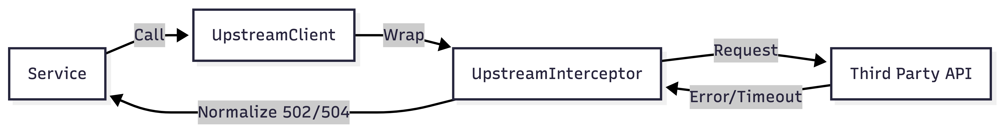

# Upstream Interceptor Pattern (Spring Boot)


This project demonstrates a lightweight, framework-friendly pattern for handling failures from third-party or upstream services in a consistent and operationally meaningful way.

The implementation is written in **Kotlin** and built on top of **Spring Boot (WebFlux)**, focusing on reliability, observability, and clean service boundaries rather than domain-specific behavior.

---

## 🛠 Tech Stack

- **Java 21** (LTS)
- **Kotlin 1.9**
- **Spring Boot 3.4** (WebFlux / Reactor)
- **Kotlin Coroutines** (Reactor Integration)
- **Gradle 8** (Kotlin DSL)
- **JUnit 5**
- **MockWebServer** (Testing)

The pattern itself is framework-agnostic and can be adapted to other HTTP or RPC clients, but Spring Boot `WebClient` is used here as the execution environment.

---

## 🚀 Running the project

This project is intentionally minimal and does not expose runtime endpoints. Its behavior is validated entirely through tests.

To build the project and run the full test suite:

```bash
./gradlew clean check
```

## Overview

This module defines a unified pattern for handling failures originating from third-party or upstream services.  
The purpose is to clearly distinguish internal service errors (500) from upstream-related failures, which are normalized to:

- **502 — UpstreamBadGatewayException** (Provider failed / Invalid response)
- **504 — UpstreamTimeoutException**

This separation enables accurate triage, reduces false on-call alerts, and provides consistent error semantics across all clients interacting with external providers.

#### The flow




##  🔍Operational impact (Why this pattern exists)

Services that depend on external systems often propagate network issues, timeouts, or upstream failures as generic 500 internal errors.  
This creates multiple operational problems:

- ❌ False alarms during on-call
- ❌ Wasted time during triage
- ❌ Inability to identify which provider is failing
- ❌ Inconsistent logs and metrics across clients

### The solution

By enforcing a clear boundary between internal failures and upstream failures,
it directly improves the day-to-day experience of operating the service.


#### On-call noise reduction

- Upstream timeouts and failures no longer surface as generic 500 errors
- Alerts can be scoped specifically to **502 (Bad Gateway)** and **504 (Gateway Timeout)**
- False positives caused by third-party outages are significantly reduced

This allows on-call engineers to quickly distinguish:
- *“Our service is broken”*
- vs
- *“A dependency is unhealthy”*

#### Faster and more accurate triage

Each normalized exception includes:
- upstream identifier
- operation name
- contextual parameters

This removes guesswork during incidents and shortens time-to-diagnosis by
making the failing dependency immediately visible.

#### Improved observability and alerting

Because error semantics are consistent across all upstream integrations:

- Dashboards can be built around upstream error classes
- Alerts can be tuned per provider or per failure type
- Metrics remain stable as new clients are added

This makes observability **scalable**, not fragile.

#### Safer ownership and scaling

The pattern centralizes error-handling behavior while keeping client code simple.
As a result:

- New integrations automatically follow the same reliability rules
- Teams do not re-implement ad-hoc error handling
- Ownership boundaries between services and providers remain clear

#### Human-centered reliability

Ultimately, this pattern optimizes for the people operating the system:

- fewer unnecessary interruptions
- clearer signals during incidents
- predictable behavior under failure

Reliability is treated as a first-class concern, not an afterthought.

---

## 💡 Core idea

All calls to third-party services flow through:

1. **`UpstreamClient`** — a small orchestrator responsible for executing upstream calls.
2. **`UpstreamInterceptor`** — pluggable interceptors that enforce cross-cutting behavior.
3. **`UpstreamErrorInterceptor`** — the interceptor that normalizes failures into 502/504 exceptions.

This design keeps business logic clean while ensuring reliability and consistency across all integrations.

---

## Usage example

Wrapping an external call:

```kotlin
val result = upstreamClient.call(
    upstream = "third_party_api",
    operation = "fetchResource",
    context = "resourceId=$resourceId"
) {
    http.get("/resources/$resourceId")
}
```

Timeouts → UpstreamTimeoutException → mapped to 504

Any other unexpected upstream failure → UpstreamBadGatewayException → mapped to 502

---

## Exception mapping
A global exception handler (e.g., ControllerAdvice) translates these exceptions into structured responses such as:

```json
{
  "timestamp": "2025-01-01T10:00:00Z",
  "status": 504,
  "error": "Gateway Timeout",
  "message": "[third_party_api_timeout] <fetchResource> Timeout ..."
}
```
This format aligns with alerting rules and makes dashboards easier to interpret.

Example: generic third-party client
`ThirdPartyClient` demonstrates how service-specific clients can remain completely free of error-handling noise.
They delegate failure classification to the upstream pattern and only focus on domain behavior.

---

## 🧪Testing strategy

This module is intentionally small, so tests are used not only for correctness,
but also to **document the behavior and design guarantees** of the upstream
error-handling pattern.

The test suite focuses on clearly answering one question:

> *What happens at the service boundary when an upstream dependency behaves well,
> misbehaves, or times out?*

### 1. Normalization of upstream timeouts (504)

```kotlin
with interceptor the timeout is normalized to UpstreamTimeoutException
```

This test verifies that timeout-related failures coming from an upstream provider
(e.g. SocketTimeoutException) are consistently classified as
UpstreamTimeoutException, which maps to HTTP 504.

#### Guarantees:

Raw timeout exceptions do not leak into the service layer

The error message includes upstream name and operation

The service exposes clear gateway-timeout semantics

### 2. Normalization of non-timeout upstream errors (502) 

```kotlin
non-timeout upstream error is normalized to UpstreamBadGatewayException
```

This test ensures that unexpected upstream failures that are not timeouts
are normalized to UpstreamBadGatewayException, mapping to HTTP 502.

#### Guarantees:

Internal 500 errors are not misused for upstream failures

All unexpected upstream errors follow a consistent classification model

Error context is preserved for observability and triage

### 3. Happy path transparency

```kotlin
   successful upstream call passes through interceptor untouched
```   
This test validates that the interceptor is non-intrusive when the upstream
call succeeds.

#### Guarantees:

No behavior changes on successful responses

Business logic remains clean and unaware of error-handling concerns

The interceptor acts strictly as a boundary safeguard

### 4. Behavior without the interceptor (baseline comparison)

```kotlin
without interceptor the raw exception leaks to the service
```   

This test intentionally demonstrates the baseline behavior without
the interceptor in place.

#### Guarantees:

Raw exceptions propagate directly to the service layer

No error normalization or contextualization occurs

Highlights the operational problem the interceptor is designed to solve

This comparison makes the value of the pattern explicit and observable.

### 5. Preservation of original failure cause
```kotlin
   normalized exception preserves original cause
```    

This test verifies that while errors are normalized, the original exception
is preserved as the cause, enabling deep debugging and accurate logging.

#### Guarantees:

No loss of low-level failure information

Improved observability without sacrificing correctness

### Summary

Together, these tests define the contract of the upstream error-handling pattern:

- Upstream failures are clearly separated from internal service errors
- Timeouts and non-timeouts are classified consistently
- Successful calls remain untouched
- Error semantics are predictable and observable
- The service boundary is explicit and well-defined

The tests serve as both verification and living documentation of the component’s intended behavior.

---